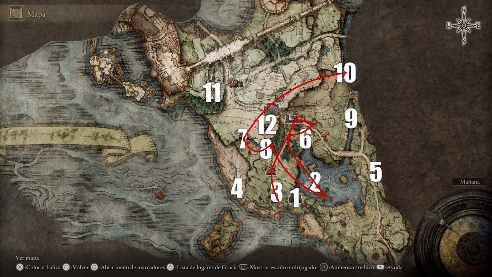
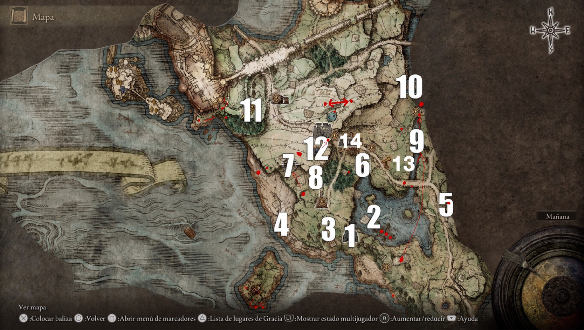

# Elden Ring [BETA INFO]

## Mapa de los bosses

## Mapa del itinerario inicial

## Mapa con los puntos de interes

En el puente:
- en el medio a un lado Fragemento de meteorito pesado
- de noche un caballero oscuro
- (13) al norte en el bosque por el lado oeste, hay un npc convertido en arbol, PEGALE!
- por aqui pasa una caravana con un set para guerrero + espadon
- en el lado oeste hay un escarabajo con cenizas de guerra Piercing Fang

Campamento Nordico al norte:
- Set armadura lobo sangriento

(14) Campamento soldados
- hoguera para coneguir el caballo y subir de nivel
- piedra con fragmento del mapa Limgrave West
- set de mago
- Libro Armero I
- Cenizas de guerra Repeating thrust
- Crimson cristal tear (para mezclar en la poti auxiliar, cura la mitad de la vida maxima MUST)

en la playa, al oeste de (7) 
- en una hoguera con un enemigo norteño, Hechizo Cure Poison
- unas pisadas blancas, un escarabajo invisible ceniza de guerra Determination

en la playa al sureste de (1)
- escarabajo con Cure Poison
- Al ir hacia el norte hay una cueva, el tutorial (1), dentro esta cenias de guerra Gravitas

en la isla del sur:
- escarabajo con Hechizo Feas Upon Flame
- subiendo por el muro del sur, en lo alto esta el Hechizo Dragonfire

en la torre / arco que esta por el camino hacia el castillo
- coil shield (escudo serpiente)

en la hoguera anterior a (11) 
- Hechizo Litany of Proper Death (eficaz contra no muertos, impide su resurreccion)

despues de (11), donde las aguilas
- cenizas de guerra Thunderbolt

en las ruinas del dragon (2)
- Libro del Desertor II
- Reduvia (daga de sangre)
- Crimson Amber Medallion (medallon de vida MUST)
- en la punta del sur del lago hay un escarabajo

CASTILLO:
- Camino de atras
    - en el bicho tocho Arsenal Charm (aumenta el peso maximo)
- Camino principal
    - cenizas de guerra Storm Stomp
    - Leon
TITANITAS
- entre (12 - 7) un gigante => x3 titanitas
- en (5) planta gigantes => titanita
- cementerio al lado de 11 => titanita
- trolls => titanita
    - al lado del campamento de soldados
    - al norte del campamento de soldados, en una meseta hay 5 trolls
    - tirando de la caravana 2 trolls
    - bajando hacia la playa por el camino desde el inicio (1)
- dentro de (4)

COMERCIANTES:
- Papa noel en la "iglesia" nada mas empezar (1)
    - Libro  I
    - Libro  I
- en la playa al suroeste donde empiezas (1)
    - Hechizo electrico
    - Libro Armero II
- Tio raro del castillo que te abre las puertas
- vende magias dentro de la dungeon (5)

DUNGEONS & BOSSES:
- (1) Nada
- (2) Dragon heart
- (3) Cenizas de guerra escudo sanador
- (4)
    - cruzas a la isla de al lado
    - Titanita
- (5)
    - Pumpkin Helmet
    - Set armadura guerrerro/mago
    - comerciante hechizos
- (6)
    - tons of minerals from walls
    - En el ascensor saltar a la mitad para ir al boss
    - Red Thorn Roundshield
    - Ceniza de guerra Gravitas
    - Dragonscale Blade (Katana) 
- (7) 
    - Libro Fervor I
    - Hechizo Oh Flame
    - Cenizas invocacion Wandering Noble
    - Hechizo Rejection
    - Fragemento de meteorito pesado
    - Ceniza de guerra Glintsword Arch (4 espadas flotantes MUST)
- (8) 
    - Espada gemela (Darth Maul)
    - colgante de resistencia (MUST)
    - frasco de mezclas (MUST)
    - mezcla ayuda a la estamina (MUST)
    - mezcla explosiva
- (9) Cerulean Crystal Tear (restaura un 20% mana)
- (10) 
    - Cenizas invocacion Mercenario Norteño (MUST)
    - Hechizo Urgen Heal
    - ceniza de guerra Storm Blade
- (11) Nada
- (12) ceniza de guerra Barricade Shield

